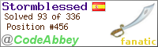

# Portfolio

## Machine Learning / Deep Learning Projects

### Image Enhancer 
Using convolutional neural networks (CNN) and libraries such as TensorFlow or PyTorch to increase the image definition and then deploy it as a web application

* &#9881;&#9881; [DEVELOPING...] &#9881;&#9881;

### Object Detection Application 

Creating an object detection model that can detect and track objects in a video stream, such as people, cars, or animals. Use the COCO dataset to train the model and then deploy it as a desktop application.

* &#9881;&#9881; [DEVELOPING...] &#9881;&#9881;

###  Twitter Sentiment about Specific Topic Web App 

Implementing natural language processing (NLP) models to analyze sentiment in some product, topic or event through tweets.Libraries like NLTK, SpaCy, or Hugging Face's Transformers.

* &#9881;&#9881; [DEVELOPING...] &#9881;&#9881;

### LLM + LangChain `:bird:`:chains: projects

Fine Tuning pre-trained LLM and link with other tools via LangChain :bird::chains:

* &#9881;&#9881; [DEVELOPING...] &#9881;&#9881;

## Programming Fan

### Web Scraping some sites
Creating web scrapers using Beautiful Soup, Requests, or Scrapy to extract useful information:
* adif-status:
This Python module allows you to obtain the arrival times of trains at different stations in Spain using the Adif website. ([GitHub](https://github.com/fjguillen-96/adif-status)).

### Sudoku Solver 

Developing a Sudoku solver using backtracking or other search algorithms, and then deploy the solver as a web application using Flask or Django. Allow users to upload images of Sudoku puzzles or enter the puzzle manually, and then display the solution on the screen.

* &#9881;&#9881; [DEVELOPING...] &#9881;&#9881;

### Google Kick Star 
My solution to some Google's Kick Start questions:

* &#9881;&#9881; [DEVELOPING...] &#9881;&#9881;

### CodeAbbey :house: 

At the request of the web itself I can't publish in Github the resolution to the problems, so I leave here the [link](https://www.codeabbey.com/index/task_list) to the web with all the problems it contains. [*if you want the code of any of them you can ask me for it without any problem  *]  

  

* &#9881;&#9881; [DEVELOPING...] &#9881;&#9881;
## Aerospace thesis 

---
### Degree's thesis: Preliminary design of hybrid propellant rocket engines 

Degree Thesis repository:

This repository can be separated in two main foldes. The rocket simulator and the chemical equilibrium app:

* Launch rocket simulation: 
text ([GitHub](https://github.com/chriskhanhtran/CS224n-NLP-Solutions/tree/master/assignments/)).

* Chemical Equilibrium with Python Applications:  
 text ([GitHub](https://github.com/chriskhanhtran/CS224n-NLP-Assignments/tree/master/assignments/a3)).

---

© 2023 Fco J. Guillen. Powered by Jekyll and the Minimal Theme.

