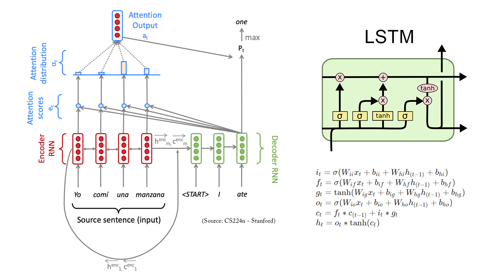
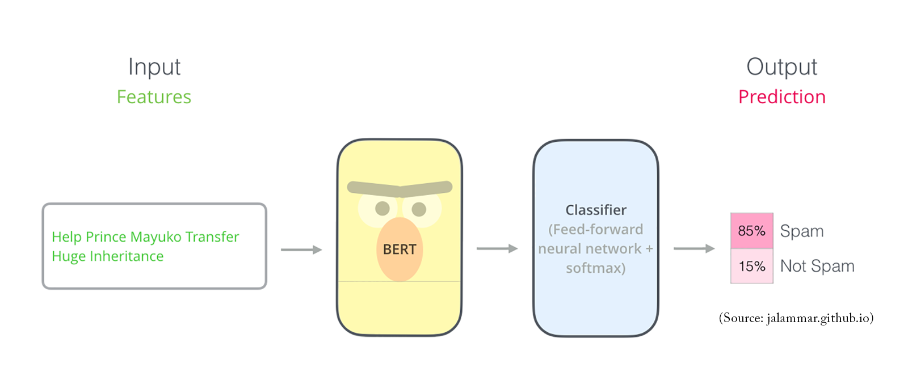

# Portfolio
---
## Aerospace thesis
### Master's thesis: Study on AI algorithms and their applications in medicine

My complete implementation of assignments and projects in [***CS224n: Natural Language Processing with Deep Learning***](http://web.stanford.edu/class/cs224n/) by Stanford (Winter, 2019).

**Starting on AI:** text ([GitHub](https://github.com/chriskhanhtran/CS224n-NLP-Solutions/tree/master/assignments/)).

**Image Segmentation of hearts:** text ([GitHub](https://github.com/chriskhanhtran/CS224n-NLP-Assignments/tree/master/assignments/a3)).

---
### Degree's thesis: Preliminary design of hybrid propellant rocket engines

text.

**Launch rocket simulation:** text ([GitHub](https://github.com/chriskhanhtran/CS224n-NLP-Solutions/tree/master/assignments/)).

**Chemical Equilibrium with Python Applications:** text ([GitHub](https://github.com/chriskhanhtran/CS224n-NLP-Assignments/tree/master/assignments/a3)).

---
### Some stuffs

text

**Adif:** text ([GitHub](https://github.com/chriskhanhtran/CS224n-NLP-Solutions/tree/master/assignments/)).

**FreeCodeCamp:** text ([GitHub](https://github.com/chriskhanhtran/CS224n-NLP-Assignments/tree/master/assignments/a3)).

 

 

---

© 2023 Fco J. Guillen. Powered by Jekyll and the Minimal Theme.

